# 基于Vue与SpringBoot的共享图片系统的设计与实现

> 公开脱敏版：保留论文正文与技术插图；学校模板、页眉页脚、校徽、身份元数据不进入公开文件，含个人资料或凭据的截图已隐藏。

目  录

## 绪论

研究背景和意义

在当今数字化和网络化日益发展的背景下，社交媒体和图片分享平台已成为人们日常生活中不可或缺的一部分。这种趋势激发了对基于Vue和Spring Boot的共享图片系统的需求，该系统旨在提供一个更加便捷、安全且用户友好的图片分享平台。

此系统的设计和实现具有重要的研究意义和实用价值。首先，它采用了前后端分离的开发模式，后端使用Spring Boot框架与Maven进行构建，前端则采用了流行的Vue.js框架。这种模式不仅提高了开发效率，也确保了应用程序在不同设备和平台上的兼容性和性能。其次，系统通过整合图片加密分享和解密功能，提供了更高层次的数据安全和隐私保护，这在当前网络安全日益受到关注的环境中尤为重要。

此外，系统还包含了以图识图等高级功能，不仅增强了用户体验，还为图像识别和人工智能技术的应用开辟了新的道路。这些功能的实现，将促进摄影爱好者和图像创作者之间的交流和合作，为他们提供一个共享和探索创意作品的理想平台。

综上所述，基于Vue和Spring Boot的共享图片系统不仅满足了现代社交媒体用户的需求，也推动了前端和后端技术的融合与创新。它的设计与实现对于促进数字媒体技术的发展，增强网络社区的互动性，以及提升网络应用的安全性和用户体验都具有深远的影响。

国内外研究现状

国际现状：在国际市场上，尽管一些平台如Instagram和Pinterest不断更新，但还有许多系统依赖过时的技术，如基本的图像处理和简单的搜索功能。这些系统缺乏诸如AI驱动的内容推荐或高级图像识别功能，限制了用户体验的提升。许多老旧系统仅提供基本的图片上传和分享功能，缺乏如直播、短视频等现代社交媒体的互动特性。在商业模式方面，一些国际平台仍依赖传统的广告收入，缺乏创新的盈利方式，如电商整合或内容付费模式。

国内情况：国内市场同样存在技术滞后的问题。一些老旧的图片分享平台仍然在使用过时的前端技术，缺乏流畅的用户界面和互动性。在中国，一些传统的图片分享平台同样面临功能陈旧的问题，难以满足用户对多样化社交体验的需求。尽管数据安全和隐私保护越来越受到重视，但一些老旧系统在这方面的措施并不充分，容易受到网络攻击和数据泄露的威胁。国内的一些老旧平台在隐私保护措施上也显得不足，不符合《网络安全法》和《个人信息保护法》等现行法规的要求。国内的一些老平台同样面临商业模式单一化的问题，难以适应市场对新型互动和营销方式的需求。

综上所述，无论是在国内还是国际市场，很多现有的图片分享系统在技术更新、功能创新、安全性保护以及商业模式多元化方面显得较为落后，这强调了对新一代图片分享系统的迫切需求，以及对现有系统进行现代化升级的重要性。

本文主要内容

本节主要介绍该论文一个整体流程，总共分为五章如下。

## 第一章：阐述基于Spring Boot与Vue的图片共享系统的开发背景与意义，阐述该系统的国内外发展现状；

第二章：阐述基于Spring Boot与Vue的图片共享系统实现所使用到的关键技术，比如搭建服务端的Spring Boot框架，构建前端的Vue框架，存储数据的MySQL数据库；

第三章：阐述基于Spring Boot与Vue的图片共享系统的用例分析，使用Visio绘制本系统的用例图，对用例图中的主要用例进行流程描述，确定本系统的功能性需求与非功能性需求；

第四章：阐述基于Spring Boot与Vue的图片共享系统的设计过程，并使用时序图阐述关键功能：登录注册，图片浏览，论坛浏览的流转过程，最后确定本系统的数据库表与数据库关系；

## 第五章：阐述基于Spring Boot与Vue的图片共享系统的实现过程，阐述关键功能是如何实现的，前端与服务端是如何进行数据交互，业务逻辑如何实现；

## 第五章：使用黑盒测试方法对Spring Boot与Vue的图片共享系统进行功能测试，并使用表格展示测试结果；

最后为总结部分，总结自己在制作基于Spring Boot与Vue的图片共享系统过程中的收货。

## 关键技术介绍

服务端技术

Spring Boot

Spring Boot是Spring框架的一个分支，Spring Boot主要核心为约定大于配置，Spring Boot首先定义好了众多Starts，然后根据项目的需要引用不同的依赖包，相比于之前Spring框架的XML配置而言，节省了许多时间，然后Spring Boot内置了Tomcat服务器，可以使项目快速运行启动，不在依赖于外置的Tomcat服务器。

系统使用Spring Boot框架搭建服务端，然后通过Maven集成JWT，MyBatis-Plus等众多其他关键依赖，并通过Application.yml配置文件进行依赖的快速配置，减少开发人员配置时间。

MySQL数据库

MySQL 是一种流行的开源关系型数据库管理系统（RDBMS），被广泛应用于各种规模的应用程序中。它具有高性能、稳定可靠、易用等特点。

MySQL 支持多种操作系统，包括 Windows、Linux、macOS 等，同时也支持多种编程语言的接口[12]，如Java、Python、PHP等，使得它可以轻松集成到各种应用程序中。

MySQL 提供了丰富的功能，包括事务处理、ACID（原子性、一致性、隔离性、持久性）属性、复制、备份和安全性等。它的存储引擎设计允许用户根据不同的需求选择合适的存储引擎，如InnoDB、MyISAM等。

Maven

要用Java实现一个后台系统，需要涉及很多模块。Web应用服务器、文件服务器、等。我们要开发这些模块，就要先把他们各自需要依赖的jar包或者项目下载打包好，然后配置到项目的class path中。需要注意的是，这些应用在运行单元测试pr编译或者部署的时候，需要依赖本地的一些配置，比如jdk、Web容器等，这样我们将项目分享出去的时候，别人要使用就有一定的配置门槛。Maven的作用就是帮我们完成上述所有的工作。

AES与RSA

AES（高级加密标准）是一种对称加密算法，广泛用于保护电子数据的安全。它通过相同的密钥进行数据的加密和解密，提供了快速且可靠的安全性。AES支持多种密钥长度，如128位、192位和256位，其中256位提供了极高的安全级别。而RSA（由Rivest、Shamir和Adleman创立）是一种非对称加密算法，使用两个不同的密钥：一个公钥用于加密，另一个私钥用于解密。RSA主要用于安全数据传输和数字签名，其安全性基于大数分解的难度。这两种算法在数据加密和网络安全领域发挥着至关重要的作用。

前端技术

Vue

Vue.js 是一款轻量级、高效且易于上手的 JavaScript 框架，用于构建用户界面和单页面应用。Vue 的核心特性包括声明式渲染、组件化、响应式数据绑定和虚拟 DOM，使得开发者能够更高效地构建可维护和可扩展的 Web 应用。Vue.js 支持插件系统和周边生态，例如 Vuex（状态管理）和 Vue Router（路由管理），进一步提升了其在复杂项目中的实用性。

## 系统分析

可行性分析

技术上的可行性分析主要为该项目能否顺利解决开发中遇到的技术性问题的分析，当下技术能否解决这些问题，因为目前我国已经有交友软件，技术也是很成熟的，所以在技术上实现并无问题。

技术上硬件用的计算机，计算机有足够的运行效率，开发当前项目没任何问题，系统软件数据库采用MySQL数据库在测试阶段是能满足需求的，MySQL在数据量不过百万级速度是不受影响的，所采用的开发语言为Java语言进行开发，而且Java拥有很完善的框架体系，实现起来并不困难网上也有很多参考文献所以技术问题也能够解决，综上所述，技术可行。

系统整体开发过程中，使用到得技术或者框架，比如Spring Boot，MyBatis，Vue，MySQL数据库都是免费且开源，然后使用得编译器比如IDEA或者WebStorm都是对学生免费得，因此系统在经济上是可行的。

在开发过程中所所使用代码都是开源的，以及自己开发的，没有涉及商业侵权问题，绝对不会存在法律问题。

判断系统后期能否正常运行，后台系统后期采用Linux系统运行，采用阿里云服务器进行部署，如果并发大后期可以采用多台服务器，所以后期运行应该可以满足当前系统正常运行。

综合分析技术、经济和法律层面，当前项目在技术上具备高度可行性，采用成熟的技术和开源框架，硬件和软件资源充足，开发和运行过程无明显障碍。经济上的可行性得以确保，采用免费开源工具和服务，降低了开发成本。法律层面上，项目使用的开源代码和自主开发的系统避免了商业侵权问题。综合而言，项目的技术、经济和法律可行性均得到充分考虑，为顺利开发和后期运行提供了有力支持。

系统需求分析

业务需求分析

基于Vue与Spring Boot的共享图片系统旨在为图片爱好者提供一个充满活力和凝聚力的社交平台，以促进摄影和图像创作领域的蓬勃发展。该系统的设计和实现的主要目的是克服摄影爱好领域的发展局限性，为广大摄影和图片爱好者提供一个完善的交流和分享环境。通过这个平台，用户不仅可以分享自己的作品，还能学习摄影技术，提升自己的创作水平，并与志同道合的朋友建立联系，从而巩固和持续发展他们的爱好。

此系统基于现代的Web开发技术，使用Vue.js作为前端框架，以其高效和灵活的特性提升用户体验；而Spring Boot作为后端框架，则确保了应用的高性能和可扩展性。系统功能涵盖了图片分享、评论、点赞、收藏以及社交互动等，构建了一个完整的图片爱好者生态圈。此外，系统还重视用户方便性和平台的多样性，计划在后期对平台进行进一步优化，使用户使用更加方便，交友更加精准，同时提升摄影技术。

基于Vue与Spring Boot的共享图片系统同样强调了互联网时代的好处，如信息传播的快速性和便捷性。与传统的摄影俱乐部和兴趣小组相比，该系统利用互联网的优势，打造了一个更为开放和便利的平台。在信息化时代，它为摄影爱好者提供了一个分享作品、交流心得、建立社交联系的理想平台，加速了摄影圈层的良性发展，并为社会的数字化转型趋势做出了积极贡献。

系统功能性需求分析

该系统分为管理员、用户两个用户角色。系统前端应用分为手机App与电脑PC端，电脑PC端主要为管理员使用进行数据管理，比如用户管理，图片管理等，App端为用户提供一个图片共享，分享，交友的平台。

系统用户用例图如下图3-1所示，主要包含登录、注册、图片浏览、论坛浏览和个人管理等主要用例。其中，图片浏览用例涵盖了图片点赞、图片收藏、分类查询、以图识图和排序查询等功能。论坛浏览用例包括论坛发布、评论发布、评论回复和内容点赞等操作。个人管理用例涵盖了信息统计、论坛管理、图片管理、图片上传、信息编辑和收藏管理等功能。

这一综合性的图片共享App旨在帮助用户轻松发布和浏览图片，提供了丰富的互动功能，包括点赞、收藏、评论和回复等。个人管理功能则为用户提供了便捷的信息管理和个性化设置的途径。通过这些功能，用户可以更好地参与社区互动，发现和分享自己喜欢的图片内容，共同构建一个充满活力的图片社交平台。

图3-1 系统用户用例图

系统用户功能详解如表3-1所属，主要阐述系统用户的登录，注册，图片浏览，论坛浏览，个人管理这几个用例的业务流程规范。以上业务流程规范涵盖了用户在系统中常见的操作，通过明确的步骤和流程，确保了用户能够顺利地使用系统的各项功能。同时，系统应该提供友好的用户界面和提示，以提升用户体验和操作便利性。

表3-1 系统用户用例规约

<table>
<tr><td>用例名称</td><td>用例描述</td><td>输入</td><td>输出</td></tr>
<tr><td>注册</td><td>App用户输入注册账号，注册密码，姓名，头像，进行注册</td><td>账号，密码，姓名，头像</td><td>注册成功/注册失败（提示失败信息：账号重复）</td></tr>
<tr><td>登录</td><td>输入账号与密码进行系统登录，登录成功系统生成JWT</td><td>账号与密码</td><td>登录成功/登录失败（账号错误/密码错误）</td></tr>
<tr><td>图片浏览</td><td>进行分类查询，排序查询，标题模糊查询，对查询的结果进行保存，下载</td><td>查询内容</td><td>查询结果图片列表</td></tr>
<tr><td>论坛浏览</td><td>进行论坛分类查询，排序查询，对论坛内容进行点赞，评论，收藏，可以发布论坛内容</td><td>论坛内容，查询内容</td><td>操作成功/操作失败</td></tr>
<tr><td>个人管理</td><td>1. 用户登录后打开个人管理页面。2. 可以修改个人资料，如密码、头像等。3. 可以查看自己上传的图片和发表的帖子。4. 用户可以删除或编辑自己的图片和帖子。5. 用户可以注销当前登录。</td><td>操作内容</td><td>操作成功/失败</td></tr>
</table>

管理员负责管理App用户、图片、论坛，并进行信息统计。这些职责共同构筑了一个内容审核平台，旨在保持App整体氛围的和谐。用例图的具体展示可参考图3-2。

图3-2 管理员用例图

系统用户功能详解如表3-2所属，主要阐述登录，App用户管理，图片管理，论坛管理这些用例的业务逻辑。

表3-1 系统用户用例规约

<table>
<tr><td>用例名称</td><td>用例描述</td><td>输入</td><td>输出</td></tr>
<tr><td>登录</td><td>输入账号，密码进行系统登录，登录成功系统生成JWT</td><td>账号与密码</td><td>登录成功/登录失败（账号错误/密码错误）</td></tr>
<tr><td>App用户管理</td><td>名称模糊查询App用户，查看App用户的统计信息（发布的论坛，图片等）</td><td>App用户的基本信息</td><td>查询结果</td></tr>
<tr><td>图片管理</td><td>后台上传图片，图片内容模糊查询，图片删除</td><td>图片内容信息</td><td>操作成功/失败</td></tr>
<tr><td>论坛管理</td><td>论坛内容模糊查询，查询该论坛的评论内容，并对其进行删除</td><td>论坛与评论内容</td><td>操作成功/失败</td></tr>
</table>

非功能需求分析

用户所更新的图片都是现拍现发的，都是原创的，同时评论点赞也是同步的，保证每一个人的作品都能的到展示，每一个人的评论都能被发现。

系统后续可发展出对于图片的批量分类，演变成一个巨大的原创图片系统，每一个作者的优美图片在被其他人看上之后能作为付费模式，付费获取优质图片，能让创作者获益，能让需要图片的人低价获取到素材，用于其他的行业和需求中去。可开一个购买者用户，能看到所有的分类的图片，在此类别中点赞较高的图片能获得优先展示并且明码标价，能不降低画质的下载图片，满足各方需求。

用户的上传很方便，在创作完车之后，只需要将图片导入其中就可以进行分类和上传，就能让其他用户看到你的作品，操作简单，节约时间。

在用户登录的时候，对于用户的账户安全进行了防护，其主要是防SQL注入。

在当今项目能够在多个操作系统系统运行已经是一个很普遍的要求，只有拥有好的移植性说明系统建设更加健全，后台是用Java语言开发的，Java本身就有很好的移植性，只要安装对应版本JDK就可以进行各个操作系统进行项目运行。

本章小结

这一章主要介绍了系统的总体分析，对开发的目的意义进行主要说明，对系统角色功能进行主要阐释，对每个角色进行功能分析和流程图分析分析各个功能模块，进行性能需求分析该系统的可扩展性、实时性、安全性等系统后期能进行优化过程进行分析。

## 系统设计

系统总体设计

系统整体上使用的是B/S架构模式，然后系统前端分为App端与后台PC管理端，这也是B/S模式中的浏览器，客户端，服务端整体为Spring Boot框架，数据层使用了MyBatis，数据库为MySQL数据库，因此本系统的总体架构流程为：App端或者PC端使用HTTP通信机制，请求服务端接口，这里涉及到了跨域请求，因此服务端需要进行跨域处理，然后服务端的接口使用MyBatis操作数据库MySQL，然后将操作结果通过JSON返回，具体的架构图如图4-1系统架构图所示。

图4-1 系统架构图

主要功能设计

登录与注册功能设计

用户首先进入注册页面，然后输入姓名、账号、密码，并选择头像，系统接收用户输入并对账号进行唯一性校验，再对密码进行签名加密。如果账号不存在，系统生成唯一用户标识，将用户信息存储在数据库中，并提示用户注册成功。替代流程包括账号已存在和密码不符合规范的情况，系统会相应提示用户。注册成功后，用户可以使用该账号和密码进行App登录，注册时序图如图4-2所示。

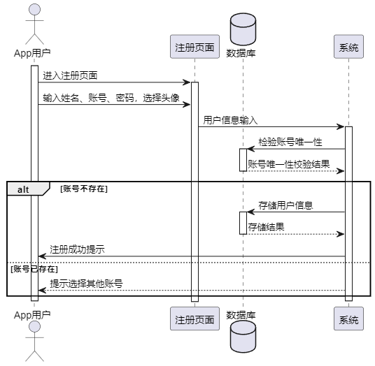

图4-2 注册时序图

App用户通过登录界面输入已注册成功的账号和密码。系统接收用户提供的账号和密码，对密码进行加密签名后，调用数据库进行账号和密码的验证。验证通过时，系统生成唯一凭证并返回给用户；验证未通过时，系统提示相应的未通过信息。登录的详细时序图可参考图4-3。

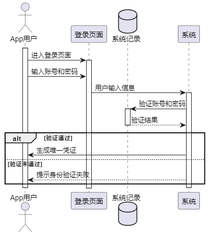

图4-3 登录时序图

论坛浏览

App用户进入信息浏览界面，通过浏览界面可以查询论坛内容，向系统发送查询请求。系统与系统记录（数据库）进行交互，获取论坛内容的结果，并将结果返回给系统。用户在浏览界面选择了排序方式，然后发布了自己的论坛内容。系统对用户发布的论坛内容进行存储，将信息存储在系统记录中。如果用户点击了论坛内容，系统会获取论坛内容的详细信息，包括评论和点赞信息。用户可以在内容详情界面发表评论，系统将用户评论存储在系统记录中。用户还可以点赞论坛内容，系统会处理点赞请求，并将结果存储在系统记录中，时序图如图4-4所示。

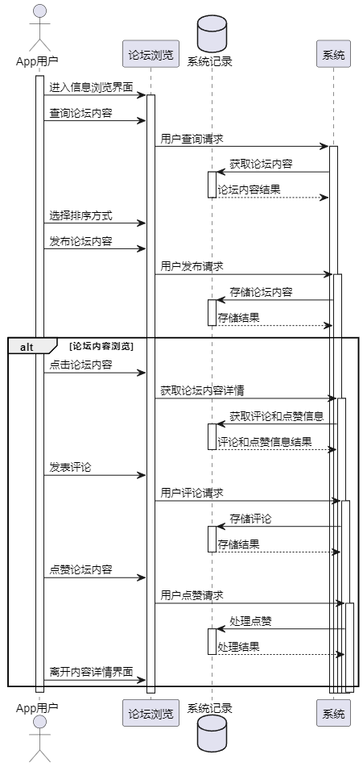

图4-4 论坛浏览时序图

图片浏览

用户首先在图片浏览界面选择图片分类，系统响应用户的请求并展示所选分类下的图片列表。用户可以进一步选择排序方式，系统重新排序并展示图片。用户在图片列表中浏览和查看详细信息，同时可以上传图片进行搜索。

在上传图片的流程中，系统提供上传选项，用户选择并上传想要查询的图片。系统处理上传的图片，展示与之相关的数据。用户还可以通过点击收藏按钮将图片添加到个人收藏夹中，便于后续查看，时序图如图4-5所示。

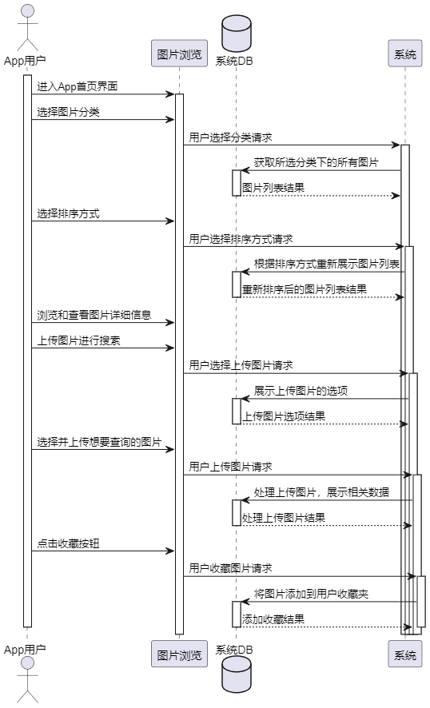

图4-5 图片浏览时序图

个人管理

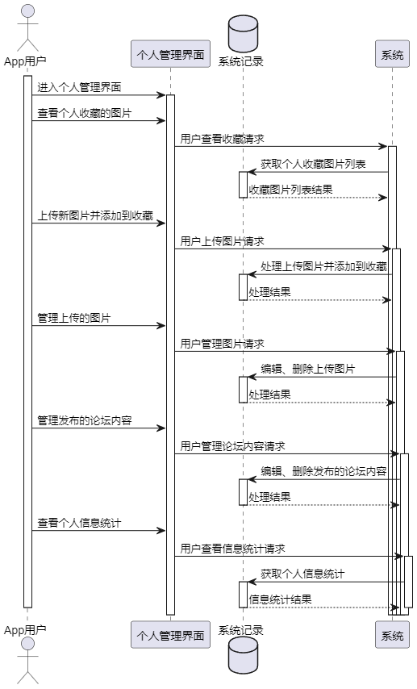

图4-6 个人管理时序图

用户进入个人管理界面，选择查看个人收藏的图片。个人管理界面发送查看收藏请求给系统，系统接收请求后向数据库发送获取个人收藏图片列表的请求。数据库处理请求并返回收藏图片列表给系统。用户上传新图片并添加到收藏，个人管理界面发送上传图片请求给系统，系统接收请求后向数据库发送处理上传图片并添加到收藏的请求，数据库处理请求并返回结果给系统。用户在个人管理界面中选择管理上传的图片，进行编辑或删除操作，个人管理界面发送管理图片请求给系统，用户在个人管理界面中选择查看个人信息统计，个人管理界面发送查看信息统计请求给系统，系统接收请求后向数据库发送获取个人信息统计的请求，数据库处理请求并返回个人信息统计结果给系统，时序图如图4-6所示。

App用户管理

时序图如图4-7所示，查询用户列表： 管理员输入要查询的用户名称的关键字，系统根据关键字进行模糊查询，返回匹配的用户列表，包括基本信息。

查看用户数据统计： 管理员选择某一用户后，系统获取该用户在App中的数据统计信息，包括活跃度、收藏数、点赞数、评论数等。

如果管理员输入的关键字无匹配结果，系统会提示管理员尝试其他关键字，提供更好的查询体验。

在查询过程中，如果管理员遇到问题，系统提供友好的反馈和帮助，确保管理员能够轻松地完成查询操作。

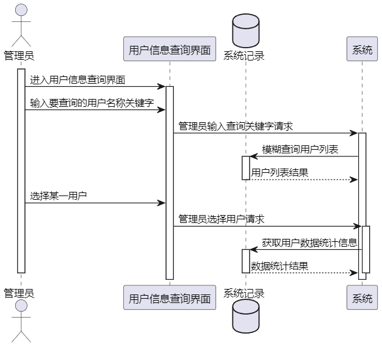

图4-7 App用户管理时序图

论坛管理

论坛管理时序图如图4-8所示，该时序图描述了管理员在后台管理界面进行论坛管理的主要操作流程。管理员通过论坛管理界面能够有效地维护和管理App中的论坛内容。

查询论坛内容： 管理员可以通过名称检索论坛内容，系统根据关键字进行模糊查询，返回符合检索条件的论坛内容列表，包括基本信息。

查看论坛详细信息： 管理员可以选择某一论坛，系统获取该论坛的详细信息，包括论坛的内容和互动情况。

查看评论内容并删除： 管理员能够查看论坛的评论内容，并对评论进行删除操作，确保评论内容符合社区规范。

删除整个论坛内容： 管理员可以选择删除整个论坛内容，以维护App整体氛围。

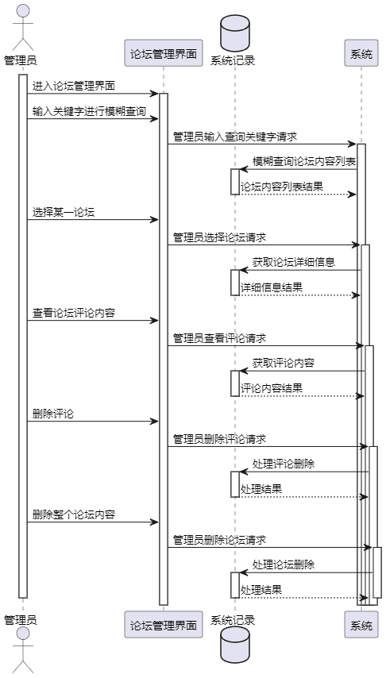

图4-8 论坛管理时序图

图片管理

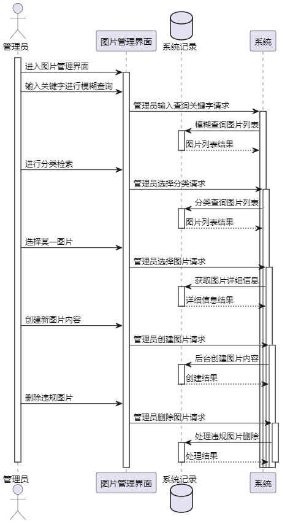

图4-9 图片管理时序图

图片管理时序图如图4-9所示，该时序图描述了管理员在后台管理界面进行图片管理的主要操作流程。管理员通过图片管理界面能够有效地维护和管理App中的图片内容。

查询图片内容： 管理员可以通过名称检索图片信息，系统根据关键字进行模糊查询，返回符合检索条件的图片列表，包括基本信息。

分类检索图片： 管理员可以进行分类检索，筛选出符合特定分类标准的图片，提供更精准的检索功能。

查看图片详细信息： 管理员选择某一图片后，系统获取该图片的详细信息，包括图片的描述、分类等。

后台创建新图片内容： 管理员具备后台创建新图片内容的功能，包括上传图片、添加描述和分类等信息，为图片库的更新提供便捷途径。

删除违规图片： 管理员可以对违规图片进行删除，确保图片内容符合社区准则，维护App中的图片库规范。

数据库设计

关系设计

通过功能设计与业务需求分析可以知道本系统应该具有8个实体：用户，评论，论坛，图片，收藏，分类，点赞，浏览，并且用户与评论，论坛，图片，收藏，点赞实体形成一对多关系，然后评论与论坛形成一对多关系，浏览与论坛形成多对一关系，图片与分类，收藏，点赞形成一对多关系，因此本系统的实体关系图如图4-10实体关系图所示。

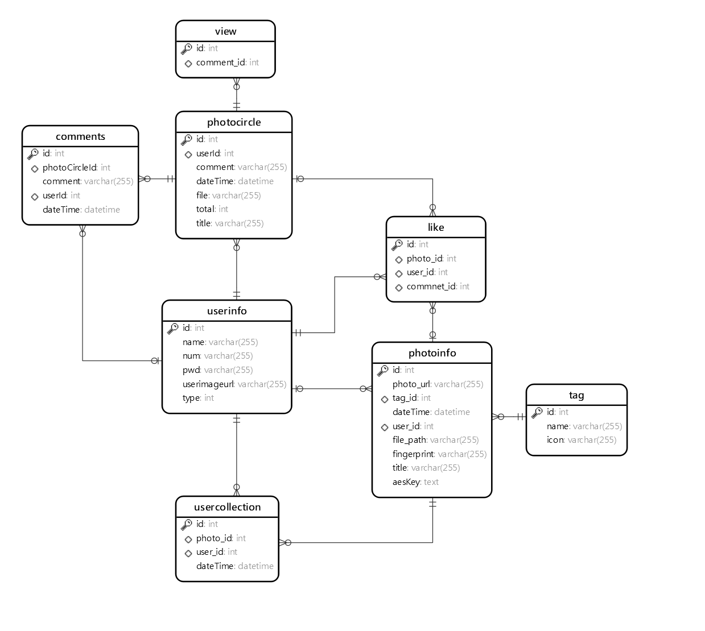

图4-10 关系图

表设计

评论信息表中的关键字段为userId关键用户表，得知该条评论来自哪个用户，photoCircleId图友圈表，评论的哪个图友圈，具体结构如表4-1comments所示。

表4-1 comments

<table>
<tr><td>列名</td><td>类型</td><td>长度</td><td>主键</td><td>允许空</td><td>说明</td></tr>
<tr><td>id</td><td>int</td><td>11</td><td>是</td><td>否</td><td>评论主键</td></tr>
<tr><td>photoCircleId</td><td>varchar</td><td>255</td><td>否</td><td>否</td><td>图有圈实体id</td></tr>
<tr><td>comment</td><td>varchar</td><td>11</td><td>否</td><td>否</td><td>内容</td></tr>
<tr><td>userId</td><td>int</td><td>11</td><td>否</td><td>是</td><td>用户id</td></tr>
<tr><td>dateTime</td><td>dateTime</td><td>0</td><td>否</td><td>是</td><td>评论时间</td></tr>
</table>

图友圈的重要字段主键id，帮助其关联的表获取基本信息，然后userId可以获取发布人信息，total字段表示评论总数，具体结构如表4-2 photocircle所示。

表4-2 photocircle

<table>
<tr><td>列名</td><td>数据类型</td><td>长度</td><td>主键</td><td>允许空</td><td>说明</td></tr>
<tr><td>id</td><td>int</td><td>11</td><td>是</td><td>否</td><td>主键</td></tr>
<tr><td>userId</td><td>int</td><td>1</td><td>否</td><td>否</td><td>用户表主键</td></tr>
<tr><td>comment</td><td>varchar</td><td>255</td><td>否</td><td>是</td><td>内容</td></tr>
<tr><td>dateTime</td><td>datetime</td><td>0</td><td>否</td><td>是</td><td>发表时间</td></tr>
<tr><td>file</td><td>varchar</td><td>255</td><td>否</td><td>是</td><td>附件信息</td></tr>
<tr><td>total</td><td>int</td><td>11</td><td>否</td><td>是</td><td>评论数</td></tr>
<tr><td>title</td><td>varchar</td><td>255</td><td>否</td><td>是</td><td>标题</td></tr>
</table>

分类表结构如表4-3tag所示，主要存储的数据为分类数据。

表4-3 tag

<table>
<tr><td>列名</td><td>数据类型</td><td>长度</td><td>主键</td><td>允许空</td><td>说明</td></tr>
<tr><td>id</td><td>int</td><td>11</td><td>是</td><td>否</td><td>分类主键</td></tr>
<tr><td>name</td><td>varchar</td><td>255</td><td>否</td><td>否</td><td>分类名称</td></tr>
<tr><td>icon</td><td>int</td><td>11</td><td>否</td><td>是</td><td>分类图标</td></tr>
<tr><td>dateTime</td><td>dateTime</td><td>0</td><td>否</td><td>是</td><td>上传时间</td></tr>
<tr><td>UpdateTime</td><td>dateTime</td><td>0</td><td>否</td><td>是</td><td>更新时间</td></tr>
</table>

用户信息表结构如表4-4userinfo所示，主要字段为userType，用来区分App用户还是后台管理用户。

表4-4 userinfo

<table>
<tr><td>列名</td><td>数据类型</td><td>长度</td><td>主键</td><td>允许空</td><td>说明</td></tr>
<tr><td>userId</td><td>int</td><td>11</td><td>是</td><td>否</td><td>用户表主键</td></tr>
<tr><td>userName</td><td>varchar</td><td>255</td><td>否</td><td>是</td><td>用户名</td></tr>
<tr><td>userPassword</td><td>varchar</td><td>255</td><td>否</td><td>是</td><td>密码</td></tr>
<tr><td>userXingming</td><td>varchar</td><td>255</td><td>否</td><td>是</td><td>姓名</td></tr>
<tr><td>userAge</td><td>varchar</td><td>255</td><td>否</td><td>是</td><td>年龄</td></tr>
<tr><td>userSex</td><td>varchar</td><td>255</td><td>否</td><td>是</td><td>性别</td></tr>
<tr><td>userPhone`</td><td>varchar</td><td>255</td><td>否</td><td>是</td><td>电话</td></tr>
<tr><td>userType</td><td>varchar</td><td>255</td><td>否</td><td>是</td><td>类型</td></tr>
<tr><td>userImg</td><td>varchar</td><td>255</td><td>否</td><td>是</td><td>头像</td></tr>
<tr><td>userImgName</td><td>varchar</td><td>255</td><td>否</td><td>是</td><td>图片名称</td></tr>
</table>

用户收藏表具体结构如表4-5 user collection所示，其中主要字段为两个外键字段：photo_id与user_id，帮助系统通过这两个字段获取哪个用户收藏了哪张图片。

表4-5 user collection

<table>
<tr><td>列名</td><td>数据类型</td><td>长度</td><td>主键</td><td>允许空</td><td>说明</td></tr>
<tr><td>id</td><td>int</td><td>11</td><td>是</td><td>否</td><td>收藏表主键</td></tr>
<tr><td>photo_id</td><td>int</td><td>11</td><td>否</td><td>是</td><td>图片表主键</td></tr>
<tr><td>user_id</td><td>int</td><td>11</td><td>否</td><td>是</td><td>用户表主键</td></tr>
<tr><td>dateTime</td><td>dateTime</td><td>0</td><td>否</td><td>是</td><td>收藏时间</td></tr>
</table>

图片表中最重要的字段为fingerprint，这是以图识图的关键字段，然后就是user_id获取哪个用户上传的图片，tag_id该分类下的图片获取，photo_url图片的静态访问地址，具体表结构如表4-6photoinfo所示。

表4-6 photoinfo

<table>
<tr><td>列名</td><td>数据类型</td><td>长度</td><td>主键</td><td>允许空</td><td>说明</td></tr>
<tr><td>id</td><td>int</td><td>11</td><td>是</td><td>否</td><td>图片信息主键</td></tr>
<tr><td>photo_url</td><td>varchar</td><td>255</td><td>否</td><td>否</td><td>图片静态访问地址</td></tr>
<tr><td>tag_id</td><td>int</td><td>11</td><td>否</td><td>否</td><td>分类id</td></tr>
<tr><td>dateTime</td><td>dateTime</td><td>0</td><td>否</td><td>否</td><td>上传时间</td></tr>
<tr><td>user_id</td><td>int</td><td>11</td><td>否</td><td>否</td><td>上传用户</td></tr>
<tr><td>file_path</td><td>varchar</td><td>255</td><td>否</td><td>是</td><td>实体路径</td></tr>
<tr><td>fingerprint</td><td>varchar</td><td>255</td><td>否</td><td>是</td><td>图片指纹</td></tr>
<tr><td>title</td><td>varchar</td><td>255</td><td>否</td><td>是</td><td>图片标题</td></tr>
<tr><td>aesKey</td><td>text</td><td></td><td>否</td><td>否</td><td>加密的key</td></tr>
</table>

## 系统实现

注册与登录实现

注册界面采用Form表单形式，如图5-1所示，通过点击事件@submit获取用户输入的姓名、账号、密码等信息。图片上传使用uni.chooseImage函数，调用服务端图片上传接口uploadImgAddUser。在该接口中，利用Java的File类保存图片，并构造图片访问的静态地址，前端收到地址后进行绑定。注册接口addUser对用户输入的账号与密码进行AES加密，确保数据安全。

AES加密功能通过注解实现。定义@EncrptInfo方法注解和@EncryptColumn字段注解。AopEncryptInfo切面捕捉所有被@EncrptInfo注解标记的方法。前置通知doBefore检查isEnOrDe值是否为真，进行加密。后置通知doAfter如果isEnOrDe值为假，表示解密，对返回的UserInfo对象中指定字段进行解密。加密和解密逻辑在encryptObject和getParamByName方法中，使用反射操作对象字段。实际加密和解密由AesUtil的静态方法执行。主要代码如代码5-1所示。

代码51 AES加密切面

<table>
<tr><td>/** * 前置通知 * 对需要加密的信息，进行加密操作 * * @param joinPoint 切点 */ @Before(&quot;controllerAspect()&quot;) public void doBefore(JoinPoint joinPoint) { //获取注解的值 EncrptInfo annotation = method.getAnnotation(EncrptInfo.class); // 获取注解Action的value参数的值 boolean value = annotation.isEnOrDe(); this.way = value; if (value) { // 获取所有参数的值 Object[] args = joinPoint.getArgs(); // 在方法签名中获取所有参数的名称 String[] parameterNames = methodSignature.getParameterNames(); encryptObject(args, parameterNames, annotation.paramName(), annotation.ParamClass(), this.way); } }</td></tr>
</table>

图5-1 注册界面

App登录界面如图5-2App登录所示，用户点击登录按钮，请求服务端接口，然后服务端对用户输入的账号与密码，进行条件查询，查看是否有符合条件的值，如果有就生成Token，然后将用户信息存入本地现成UserThreadLocal中，然后通过构造函数，完成用户基本信息的构造，在返回给前端，前端对Token与用户基本信息进行缓存，同样的登录接口上也有AOP的AES加密注解EncrptInfo，使系统自动对用户输入的账号与密码进行加密处理。

图5-2 登录界面

图片浏览实现

图5-3 APP首页

App首页界面如图5-3首页所示，首页主要查看本系统中App用户或者后台管理用户上传的图片，进入首页会访问服务端接口/photo/app/list，获取所有图片信息，这里进行了分页查询与链接查询，图片表与分类表有外键关系，通过外键链接查询，查出每张图片对应的分类信息，然后在使用PageHelper分页插件进行分页实现，前端使用v-for="item in list"对接口返回的图片List进行循环展示，然后使用{{}}进行值得绑定。关键代码如代码5-2所示。

代码52 列表查询

<table>
<tr><td>SELECT t1.id, t1.photo_url AS photoUrl, t1.tag_id AS tagId, t1.dateTime, t1.user_id AS userId, t1.file_path AS filePath, t1.fingerprint, t1.title, t2.name AS tagTitle, COUNT(DISTINCT t3.id) AS collectTotal, COUNT( DISTINCT t4.id) AS likeTotal, t5.name as userName, t5.userimageurl FROM photoinfo t1 JOIN tag t2 ON t1.tag_id = t2.id LEFT JOIN usercollection t3 ON t1.id = t3.photo_id LEFT JOIN liketable t4 ON t1.id = t4.photo_id LEFT JOIN userinfo t5 ON t1.user_id = t5.id &lt;where&gt; &lt;if test=&quot;tagId != null&quot;&gt; AND t1.tag_id = #{tagId} &lt;/if&gt; &lt;if test=&quot;title != null and title != &#x27;&#x27;&quot;&gt; AND t1.title LIKE CONCAT(&#x27;%&#x27;, #{title}, &#x27;%&#x27;) &lt;/if&gt; &lt;/where&gt; GROUP BY t1.id, t1.photo_url, t1.tag_id, t1.dateTime, t1.user_id, t1.file_path, t1.fingerprint, t1.title, t2.name &lt;choose&gt; &lt;when test=&quot;sort == 0&quot;&gt; ORDER BY t1.dateTime DESC &lt;/when&gt; &lt;when test=&quot;sort == 1&quot;&gt; ORDER BY t1.dateTime ASC &lt;/when&gt; &lt;when test=&quot;sort == 2&quot;&gt; ORDER BY collectTotal DESC &lt;/when&gt; &lt;when test=&quot;sort == 3&quot;&gt; ORDER BY collectTotal ASC &lt;/when&gt; &lt;when test=&quot;sort == 4&quot;&gt; ORDER BY likeTotal DESC &lt;/when&gt; &lt;when test=&quot;sort == 5&quot;&gt; ORDER BY likeTotal ASC &lt;/when&gt; &lt;/choose&gt;</td></tr>
</table>

首页上方为标题模糊查询，分类查询，排序查询入口，分类列表的获取由接口tagList实现，使用了select，left join on count group by关键字进行条件查询，并统计出每个分类下图片的结果，前端部分在使用v-for进行循环展示。

用户在输入框中输入内容，点击键盘上的确认或者回车，触发前端函数searchHandle，在该函数中，使用双向绑定与前端this指针，将data中的数据title赋值为用户输入的值，然后清空分页查询方法，再次访问函数getData，请求服务端接口/photo/app/list，服务端使用MyBatis的<where>与<choose>完成动态SQL拼接，结果如图5-4所示。

以图识图使用了谷歌的指纹算法，实现思路为将上传的图片压缩成8x8的大小，64的像素，然后计算所有64个像素的灰度平均值，将每个像素的灰度，与平均值进行比较。大于或等于平均值，记为1；小于平均值，记为0，将上一步的比较结果，组合在一起，就构成了一个64位的整数，这就是这张图片的指纹。组合的次序并不重要，只要保证所有图片都采用同样次序就行了，这里得到了不同的指纹，在通过得到指纹以后，就可以对比不同的图片，看看64位中有多少位是不一样的，完成以图识图。

图5-4 图片查询结果

用户点击分类排序中的分类按钮，触发时间search，同样的方式将tagId的值赋值为用户点击的列表中的元素值，然后请求服务端接口，完成分类查询，用户点击设置按钮，App打开弹窗，弹窗通过v-if控制，用户可以选择排序方法，完成图片列表的排序查询，如图5-5所示。

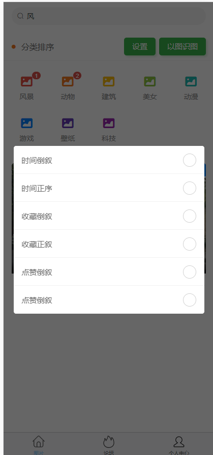

图5-5 排序查询

登录过的App用户可以进行图片保存，点赞，收藏操作，用户点击图片列表中的图片，触发预览函数ViewImage，在函数中使用uni.previewImage，进行图片预览，首先初始化一个列表imageList，然后使用push方法，将ViewImage的函数的参数放入列表中，即可进行预览，点击长按即可保存图片至手机相册，如图5-6所示。

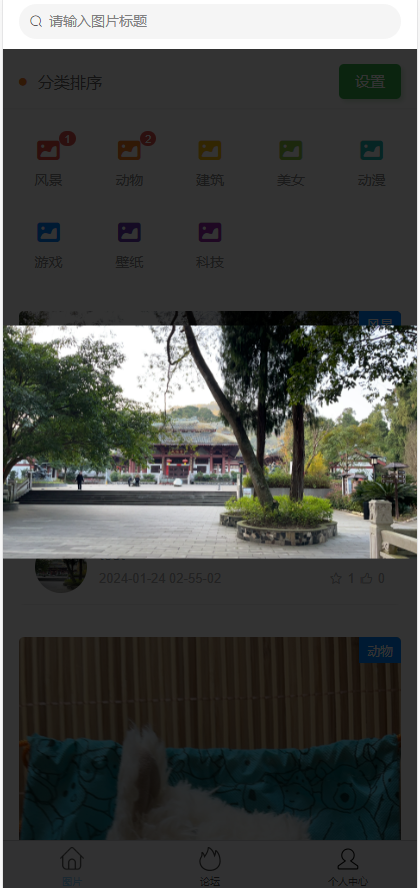

图5-6 图片预览与保存

用户点击列表中的收藏与点赞icon触发函数: addCollect与addLike，函数中使用uni.request进行接口请求，在接口首先使用Mapper接口进行数据库访问，检测该用户是否进行过收藏与点赞，如果有此类操作，则提示重复操作，如果没有则使用insert语句完成收藏与点赞操作如图5-7所示。

图5-7 收藏与点赞

论坛实现

论坛的内容与图片内容基一致，因此这里将图片列表前端代码抽成组件photo-card，定义两个props类list与type，由于论坛列表与图片列表有些地方展示效果不一样，因此定义type，配合v-if可以灵活展示不同区域，list为服务端来的图片列表数据与论坛列表数据，然后论坛同样可以进行下拉刷新与上拉加载，使用了uni的onPullDownRefresh与onReachBottom函数，论坛列表界面如图5-8所示。

图5-8 App论坛列表

用户同样可以点击点赞icon进行论坛内内容点赞，点击列表中的图片可以进行图片预览，点击图片上的文字可以查看该论坛的所有内容，当用户点击文字时，触发跳转函数detailInfo，并传入该内容的主键，跳转到内容详情界面，该界面以传入的主键为参数请求服务端接口，获取该内容的详细信息与评论信息，然后使用v-for="(comment,index) in commentList"语句对评论内容进行循环渲染展示。关键代码如代码5-3所示。

代码53 内容点赞

<table>
<tr><td>UserInfo userInfo = UserThreadLocal.getUser(); if (!photoInfo.getType()) { //查看是否重复点赞 if (likeMapper.selectCountByPhotoIdAndUserId(photoInfo.getId(), userInfo.getId()) == 1 || likeMapper.selectCountByPhotoIdAndUserId(photoInfo.getId(), userInfo.getId()) &gt; 1) { return success(&quot;请勿重复点赞&quot;); } else { likeMapper.addLike(new LikeTable(userInfo.getId(), photoInfo.getId())); return success(); } } else { //查看是否重复点赞 if (likeMapper.selectCountByCommentIdAndUserId(photoInfo.getId(), userInfo.getId()) == 1 || likeMapper.selectCountByCommentIdAndUserId(photoInfo.getId(), userInfo.getId()) &gt; 1) { return success(&quot;请勿重复点赞&quot;); } else { LikeTable likeTable = new LikeTable(); likeTable.setCommentId(photoInfo.getId()); likeTable.setUserId(userInfo.getId()); likeMapper.addLikeT(likeTable); return success(); } }</td></tr>
</table>

用户可以在界面最下方输入评论，然后点击评论按钮，App请求服务端接口/api/photo/ addComment，评论成功后，App自动刷新页面，展示最新的评论信息，并通过评论字段reply与当前登录用户（登录界面缓存数据）与该发布内容用户（userId）的判断，判断是否显回复按钮与删除按钮，如图5-10所示。

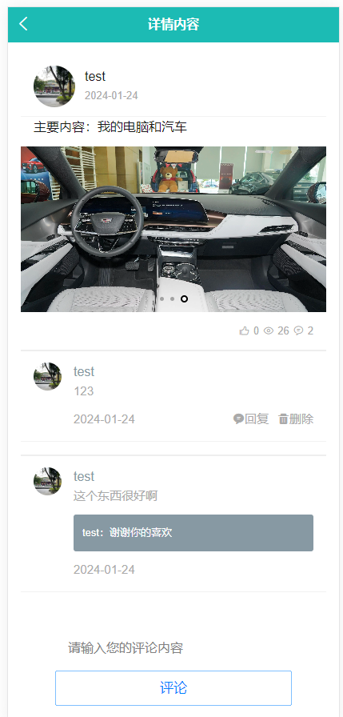

图5-10 论坛详情

论坛发布界面如图5-11所示，界面整体是一个Form表单，用户输入完内容，选择完图片后，点击发布，App请求服务端接口addPhotoCircle，服务端使用insert语句将数据插入表中，然后App跳转界面至论坛界面。

图5-11 论坛发布

个人管理实现

个人中心界面如图5-12所示，用户点击头像可以修改个人信息，使用了的页面是注册页面，然后使用Vue的双向绑定将值渲染在上面，头像下方是操作导航栏，到导航栏中还有该用户在本App中的数值统计，由接口staticCount提供数据，最后是退出登录按钮。

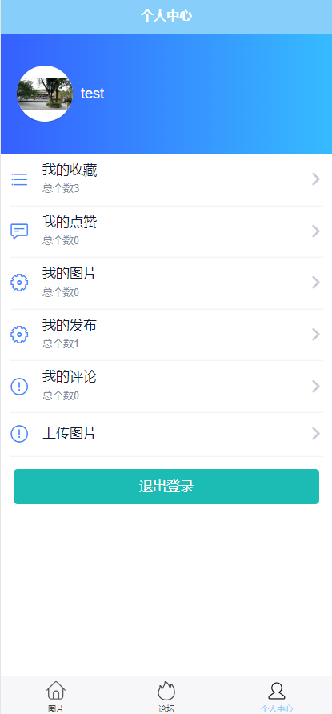

图5-12 个人中心

我的收藏，我的点赞，我的图片，我的发布都是与论坛与图片有关，因此在实现这里的时候，一个页面展示这些内容，实现界面如图5-13所示，用户可以在此界面进行收藏/点赞/评论等数据的删除，还可以进行论坛详情页的查看与图片的在此保存。

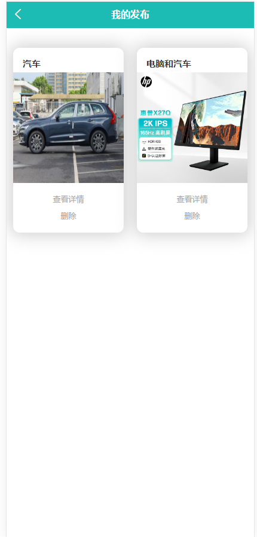

图5-13 个人中心详情页

用户点击个人中心界面的上传图片按钮，App跳转到图片上传页面，页面整体为Form表单，用户上传图片后，系统通过指纹算法，获取该图片的指纹，图片上传界面如图5-14所示。

图5-14 图片上传

App用户管理实现

用户管理界面如图5-15所示。管理员能够查看系统中的所有App用户信息。系统服务端通过SELECT COUNT语句对App用户的操作进行全面统计，包括收藏总数、点赞总数等。此外，管理员还可以执行批量删除操作，并且支持对用户进行名字的模糊查询。服务端通过使用LIKE关键字实现模糊查询，并结合PageHelper插件实现了分页功能。前端界面采用了饿了么UI的el-pagination组件用于分页展示，同时使用el-table组件展示用户信息。这样的设计使得用户管理界面更加直观、功能丰富，提高了系统的易用性，关键代码如代码5-5所示。

代码55 用户列表获取

<table>
<tr><td>public Result page(Page page) { PageHelper.startPage(page.getPageCurrent(), page.getPageSize()); List&lt;UserInfo&gt; userInfos = userInfoMapper.selectUserByLikeUserName(page.getUserName()); userInfos.forEach(x-&gt;{ x.setCollectTotal(userInfoMapper.totalCollect(x.getId())); x.setLikeTotal(userInfoMapper.totalLike(x.getId())); x.setCommentTotal(userInfoMapper.totalComment(x.getId())); x.setPoTotal(userInfoMapper.totalPo(x.getId())); }); return success(new PageInfo&lt;UserInfo&gt;(userInfos)); }</td></tr>
</table>

图5-15 App用户管理

图片管理实现

图5-16 后台图片管理

图片管理界面如图5-16后台图片管理所示，列表的实现方式与后台用户管理一致，使用了饿了么UI的Table组件，然后分页组件也是使用了此UI的el-pagination，这里主要讲述上传图片的实现，首页后台用户可以在后台上传图片，上传界面如图4-27后台图片上传所示，图片上传后，服务端会使用汉明算法，生成有关该图片的哈希指纹，这是以图识图的关键字段。

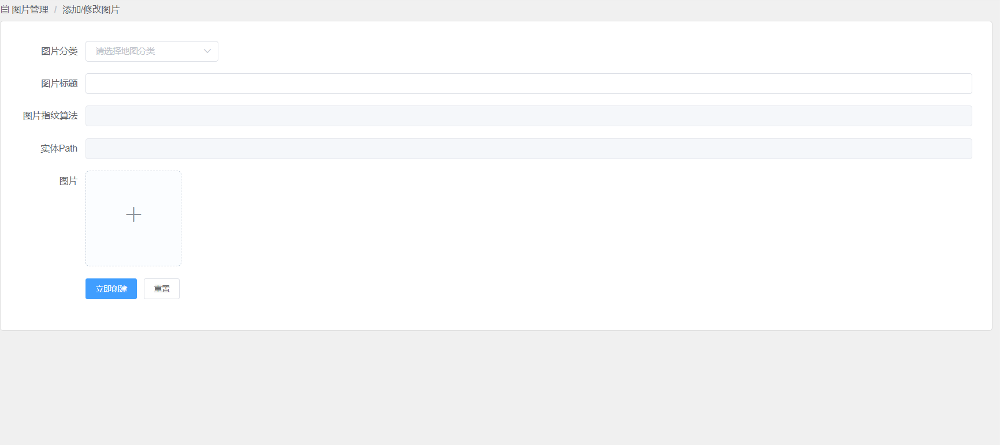

图5-17 后台图片上传

论坛管理实现

图5-18 列表

论坛列表界面如图5-18所示，管理员用户可以对App用户在论坛发布的评论内容进行管理，即可查看该论坛的评论时光轴如图5-19所示，管理员可以查看时间正序排序的用户评论，并可以删除不好的评论，来维持App的良好风气。

图5-19 评论查看

本章小结

本章节阐述了基于Spring Boot与Vue的图片共享系统的实现过程，阐述如何通过Spring Boot与Vue实现系统的登录，注册，图片浏览，论坛等功能，并贴出主要代码阐述实现逻辑。

## 系统测试

测试方法与环境

系统测试是确保系统功能正常运行的重要环节，包括功能测试和非功能测试两部分。

功能测试采用黑盒测试方法，通过模拟用户操作，验证系统在输入数据或点击按钮后的反馈是否符合预期。

非功能测试主要进行系统兼容性测试，确保系统在不同版本的浏览器和主流手机上都能正常运行。测试环境为Windows 11，Java版本为1.8，H5模拟App运行环境，浏览器为谷歌浏览器。

功能测试

登录注册测试用例中，测试员主要模拟App用户进行注册与登录，主要测试注册过程中输入同样的账号是否被系统检测，登录过程中输入错误的账号与密码是否可以被系统检测，如表6-1所示。

表6-1 App登录注册测试用例表

<table>
<tr><td>测试序号</td><td>操作描述</td><td>数据</td><td>期望结果</td><td>实际结果</td><td>测试状态</td></tr>
<tr><td>1</td><td>进行系统注册，此时系统中有账号为cs的用户</td><td>账号cs，密码：123456</td><td>注册失败</td><td>账号重复</td><td>通过</td></tr>
<tr><td>2</td><td>进行系统注册，此时系统没有App用户</td><td>账号cs，密码：123456</td><td>注册成功</td><td>注册成功</td><td>通过</td></tr>
<tr><td>3</td><td>进行系统登录，测试系统有账号cs，密码123456</td><td>账号cs，密码：123456</td><td>登录成功</td><td>登录成功</td><td>通过</td></tr>
<tr><td>4</td><td>进行系统登录，测试系统有账号cs，密码123456</td><td>账号cs，密码：1234562</td><td>登录失败</td><td>登陆失败</td><td>通过</td></tr>
</table>

图片内容浏览测试用例中，主要测试未登录的用户是否可以进行点赞，收藏；测试图片内容搜索，排序是否正常，结果如表6-2所示。

表6-2 图片内容浏览测试用例表

<table>
<tr><td>测试序号</td><td>操作描述</td><td>数据</td><td>期望结果</td><td>实际结果</td><td>测试状态</td></tr>
<tr><td>1</td><td>未登录用户收藏</td><td>无</td><td>请登录</td><td>跳转登录界面</td><td>通过</td></tr>
<tr><td>2</td><td>登录用户进行收藏操作</td><td>图片内容1</td><td>收藏成功</td><td>收藏成功</td><td>通过</td></tr>
<tr><td>3</td><td>登录用户进行收藏操作</td><td>图片内容1</td><td>请勿重复收藏</td><td>请勿重复收藏</td><td>通过</td></tr>
<tr><td>4</td><td>进行图片内容排序查询</td><td>排序的内容</td><td>排序成功</td><td>排序成功</td><td>通过</td></tr>
<tr><td>5</td><td>进行图片内容模糊查询</td><td>模糊查询的内容</td><td>查询成功</td><td>查询成功</td><td>通过</td></tr>
</table>

论坛浏览测试用例中，同样测试系统是否有登录拦截，是否可以正常进行论坛内容的浏览与评论，评论回复操作，测试结果如表6.3所示。

表6-3 论坛浏览测试用例表

<table>
<tr><td>测试序号</td><td>操作描述</td><td>数据</td><td>期望结果</td><td>实际结果</td><td>测试状态</td></tr>
<tr><td>1</td><td>未登录用户进行论坛点赞，评论，收藏操作</td><td>论坛数据</td><td>请登录</td><td>请登录</td><td>通过</td></tr>
<tr><td>2</td><td>登录用户进行论坛收藏操作</td><td>论坛数据1</td><td>收藏成功</td><td>收藏成功</td><td>通过</td></tr>
<tr><td>3</td><td>登录用户进行论坛收藏操作·</td><td>论坛数据1</td><td>请勿重复收藏</td><td>请勿重复收藏</td><td>通过</td></tr>
<tr><td>4</td><td>登录用户进行论坛评论操作</td><td>论坛数据1与评论数据</td><td>评论成功</td><td>评论成功</td><td>通过</td></tr>
<tr><td>5</td><td>论坛数据1的发布用户进行评论回复</td><td>论坛数据1，评论数据，回复数据</td><td>回复成功</td><td>回复成功</td><td>通过</td></tr>
</table>

图片管理测试用例如表6-4所示，测试图片上传是否存储了该图片指纹数据，测试管理员进行图片删除，App是否显示被删除的图片，管理员是否可以修改该图片对应的标题，后台操作是否登录拦截，前台用户是否可以操作后台。

表6-3 论坛浏览测试用例表

<table>
<tr><td>测试序号</td><td>操作描述</td><td>数据</td><td>期望结果</td><td>实际结果</td><td>测试状态</td></tr>
<tr><td>1</td><td>测试图片上传存储指纹数据</td><td>上传的图片</td><td>获取到该图片指纹并存入到数据库中</td><td>图片指纹数据正确获取且存储成功</td><td>通过</td></tr>
<tr><td>2</td><td>测试管理员删除图片</td><td>选择要删除的图片</td><td>图片被删除</td><td>图片被删除，App端无法查看该图片</td><td>通过</td></tr>
<tr><td>3</td><td>测试修改图片标题</td><td>标题内容</td><td>修改成功</td><td>修改成功，App端同步更新</td><td>通过</td></tr>
<tr><td>4</td><td>测试后台操作是否进行了登录拦截</td><td>未登录删除图片</td><td>请登录</td><td>请登录</td><td>通过</td></tr>
<tr><td>5</td><td>测试App用户是否可以操作后台</td><td>App用户操作后台接口删除图片</td><td>拦截</td><td>拦截</td><td>通过</td></tr>
</table>

本章小结

系统通过了一系列的黑盒测试，系统可以正常运行。

## 结论

基于Spring Boot与Vue的图片共享系统是一个强大的网络应用程序，旨在提供用户友好的界面和高效的图片管理功能。Spring Boot作为后端框架，提供了稳健的服务器端支持，而Vue作为前端框架，则负责呈现动态内容和用户交互。

该系统的核心功能包括用户认证、图片上传、浏览和下载等。用户可以通过注册和登录功能创建自己的账户，实现个性化的图片管理。图片上传功能允许用户轻松地将自己的图片分享到系统中，而系统的浏览和下载功能则使其他用户能够浏览和获取这些分享的图片。

通过Spring Boot提供的安全框架，用户的账户和数据得到了有效地保护，确保了系统的稳健性和安全性。同时，Spring Boot的自动化配置和简化的开发流程使得后端开发变得更加高效，减少了开发者的工作量。

Vue作为前端框架，通过其响应式设计和组件化开发，为用户提供了流畅的交互体验。用户可以通过Vue的界面快速浏览图片、进行搜索、评论和分享等操作，实现了一个直观而丰富的用户界面。

总的来说，基于Spring Boot与Vue的图片共享系统结合了强大的后端支持和优秀的前端交互，为用户提供了一个高效、安全且易于使用的图片管理平台。其稳定性、安全性和用户友好性使其成为一个值得信赖和推荐的网络应用程序。
